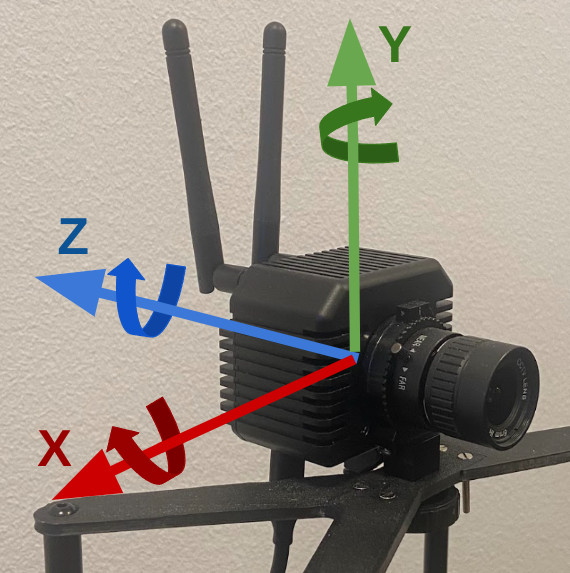

# Sensorleap IMU

This repository contains a demo to stream live IMU data from a sensorleap sensor and to use this data to
estimate roll, pitch and yaw (assuming constant position). The demo uses a kalman filter to fuse data from the gyroscope
with the data from the accelerometer.


Setup sensorleap sensor with IMU enabled. Guide (TODO)

Let sensor (or robot with sensor mounted on) still on a level surface, then run calibration: 

```bash
python calibrate_imu.py
```

This will dump a file (imu_calib.txt) with calibration values for the 6 DoF for the BMI088 IMU. For the gyroscope,
it simply computes mean values over a time period which can then be subtracted from measurement values to get values
closer to 0 when holding still. For the accelerometer, we assume it is mounted in a level manner. Then we compute mean values over a time period. For x and z, we can subtract their mean values from measurement values to get values closer to 0. For y, we expect the value to be close to -g. We estimate the gravity value of the accelerometer by
```python
mean_g = np.mean(np.sqrt(np.square(acc_x) + np.square(acc_y) + np.square(acc_z)))
```
and use this estimated gravity value to compute a correction to the accelerometers y measurement. This correction value is 
stored in imu_calib.txt.

To stream and visualize the IMU data, run
```bash
python show_graph.py
```
You should see a window appear similar to this:


For your own window, notice that the calibration is off. Accelerometer is probably not at (0,-1g,0) and the gyroscope is drifting a lot. To take the IMU calibration into account when visualizing the streamed data, run:

```bash
python show_graph.py --calib imu_calib.txt
```

To record IMU data to text file, run:
```bash
python show_graph.py --record
```
This will create a file: record_imu.txt.

To use the recorded data instead of live streamed data, do:
```bash
python show_graph.py --calib imu_calib.txt --recording record_imu.txt
```

To see the IMU data visualized with OpenGL, run:
```bash
python gl_imu.py --calib imu_calib.txt
```
and with recorded data:

```bash
python gl_imu.py --calib imu_calib.txt --recording record_imu.txt
```

Note that the IMU provides data in a right handed coordinate system following the convention from OpenGL:


